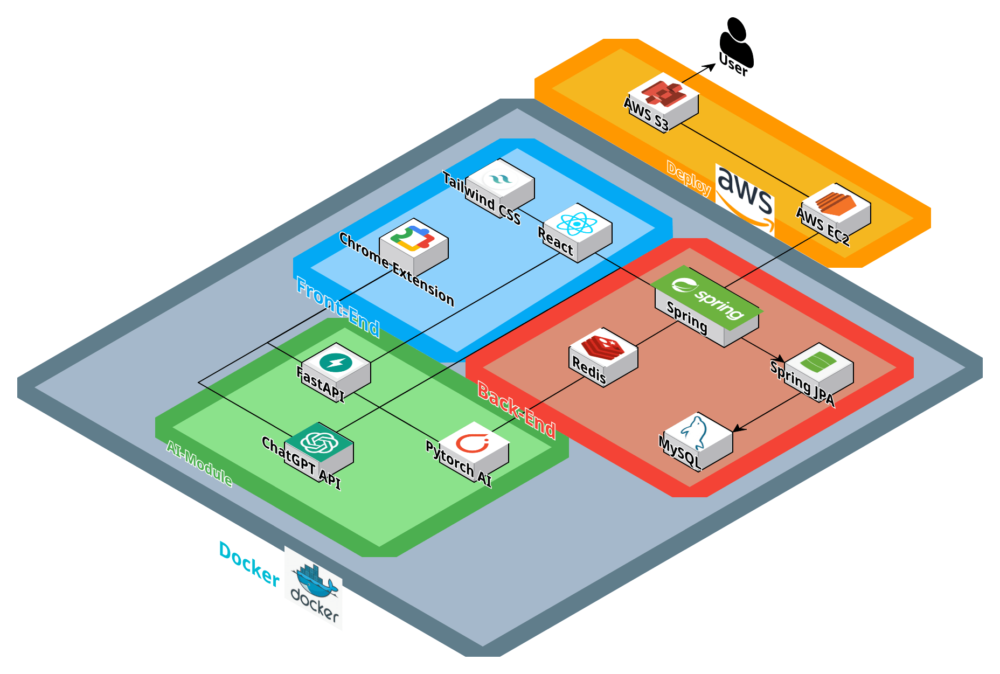

# **북마크 기반 큐레이션 서비스**   

 

## 📖 **프로젝트 개요**
관심 있는 콘텐츠를 보기 쉽게 확인하고, 공유 컬렉션을 통해 소통하며 북마크를 보다 체계적으로 활용할 수 있는 북마크 기반 큐레이션 서비스입니다.

 

## Commit Convention

커밋 메시지는 명확하고 일관성 있게 작성합니다.  
**형식:** `<태그>: <제목>` (태그 뒤에만 한 칸 공백)  

### 태그 목록
- **feat:** 새로운 기능 추가  
- **fix:** 버그 수정  
- **docs:** 문서 수정 (README, 주석 등)  
- **style:** 코드 포맷팅, 세미콜론 누락 등 코드 로직 변경이 없는 경우  
- **refactor:** 코드 리팩토링 (기능 변화 없이 구조 개선)  
- **test:** 테스트 코드 추가 또는 수정  
- **chore:** 빌드 설정 변경, 패키지 매니저 수정 등  

### 예시

## 🚀 **주요 기능**
1. **북마크 관리 및 분류**
   - 크롬 익스텐션을 통한 북마크 추가 및 관리
   - 태그 기반 북마크 분류와 중요도 설정
   - 개인 및 공유 컬렉션으로 북마크 분리 관리

2. **공유 컬렉션**
   - 공유 컬렉션 생성 및 친구 초대
   - 공유된 북마크와 메모를 통한 소통통

3. **알림 기능**
   - 읽지 않은 북마크 알림
   - 공유 컬렉션 메모 추가 및 초대 알림
   - RSS 업데이트 알림

4. **추천 및 검색**
   - 관심 키워드와 태그를 기반으로 한 북마크 추천
   - 태그를 활용한 북마크 검색

 

## 💡 산출물 

### ERD

### Architecture Diagram

### User Flow & Wire Frame
[🔗 User Flow](https://www.figma.com/board/Ce1fyDbZh7lUdKMhZG1E4r/A208---FlowChart?node-id=0-1&p=f&t=gaoDUj24KI55Ow2o-0)
 
[🔗 Wire Frame](https://www.figma.com/design/uAl2EqrRoCL7BtRWtmnprv/A208---WireFrame?node-id=0-1&t=VfCv9iurRQE2e5lK-1)

### API 명세서
[🔗 API Docs](https://eenzzi.notion.site/API-17a45cc04c9d80e4accef604699f301b?pvs=4)

### 팀 노션

 

## 🛠️ **기술 스택**
- **Frontend**: React  
- **Backend**: Spring Boot, JPA 
- **Database**: MySQL, Redis
- **Infra**: Docker, Prometheus, Grafana
- **External Integration**: RSS Feed, Chrome Extension  

 
 
